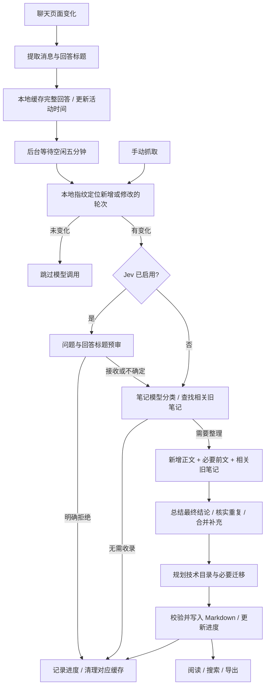

# 🌳 AI 知识树

把与 AI 的学习对话整理成自己的 Markdown 知识库。正常聊天，停下来后自动归纳；按技术组织目录，在浏览器中阅读，需要时导出。

**版本 1.3.0 · Chrome / Edge Manifest V3 · 原生 JavaScript · MIT**

设计原则：**简单、轻量、高效、省事**。无需部署服务器、数据库或额外笔记服务。

## 功能

- **空闲自动整理**：检测对话和输入活动，停止活动约五分钟后在后台处理。
- **关闭标签页后继续**：完整回答暂存本地，关闭聊天页面不取消任务；退出整个浏览器后，下次启动再恢复。
- **提炼笔记**：从多轮对话凝练最终结论，吸收用户提问和阶段性结论，省去被推翻的中间答案和问答形式，重点用 ⭐ 标记。
- **按技术分类**：例如 `软件开发 → 桌面应用开发 → Electron → 进程通信`，不直接照搬 AI 回答的标题层级。
- **动态调整目录**：新学 Python 2 时，可把明确属于 Python 3 的旧内容迁移到 `Python / Python 3`；通用内容不强行猜版本。
- **增量和去重**：本地指纹识别新增、修改的消息，模型再与相关旧笔记核对、合并或补充。
- **标签筛选**：匹配任意一个标签即可收录，留空则不限制学习主题。
- **可选 Jev 预审**：验证 TypeSafe Key 后启用 Jev 审核；笔记模型继续负责分类、总结和目录调整。
- **阅读与管理**：上层目录卡片导航，末端主题连续阅读和大纲跳转；右键节点删除，右键末端知识点编辑。
- **学习标记**：近期内容用绿色标记，重复学习用星标层级表示，避免目录充满不同颜色。
- **导出 Markdown**：带知识结构和来源链接，可用 Typora 等阅读器打开。

## 安装

### 获取代码

```bash
git clone https://github.com/CMooningi/ai-knowledge-tree.git
cd ai-knowledge-tree
```

也可以在仓库点击 **Code → Download ZIP**，下载后解压。

### 加载到浏览器

1. Chrome 打开 `chrome://extensions`，Edge 打开 `edge://extensions`。
2. 开启「开发者模式」。
3. 点击「加载已解压的扩展程序」或「加载解压缩的扩展」。
4. 选择包含 **manifest.json** 的 `ai-knowledge-tree` 文件夹。
5. 将扩展固定到工具栏，方便打开预览和设置。

**运行扩展不需要 npm install，也不需要构建。** Node.js 只用于开发测试。

## 初次设置

点击扩展图标 →「设置」。

### 笔记整理模型（必需，选择一个渠道）

**DeepSeek 官方：**

1. 在 [DeepSeek 开放平台](https://platform.deepseek.com/) 获取自己的 API Key。
2. 填入扩展设置，选择模型，点击「保存配置」。默认模型为 `deepseek-chat`。
3. 点击「测试连接」，确认账号、密钥和网络可用。

**OpenRouter：**

1. 在 [OpenRouter Keys](https://openrouter.ai/settings/keys) 创建 API Key。
2. 在「笔记整理模型」里将调用渠道改为「OpenRouter」。
3. 填写 OpenRouter Key，从模型页面复制完整的文本模型 ID；需要支持 JSON 输出。
4. 点击「测试连接」验证实际模型调用及 JSON 输出，再点击「保存配置」启用。

两种渠道的密钥与模型分别保存，切换填写区域不会立即改变后台使用的配置。测试会发送一次简短的真实模型请求，可能产生少量费用；测试成功不会自动保存。原有用户默认继续使用 DeepSeek，不需要迁移已有配置。

### Jev（可选，TypeSafe 或 OpenRouter）

1. 选择「TypeSafe 官方」时，通过 [TypeSafe 官方文档](https://docs.typesafe.ai/introduction/quickstart) 获取账号与 API Key。
2. 在 Jev 设置区域填写 TypeSafe API Key，点击「验证并保存」。
3. 验证成功后启用收录预审；可随时移除 Jev 密钥。

使用 OpenRouter 调用 Jev：

1. 在「Jev 收录预审」把渠道改为「OpenRouter」。
2. 填写 OpenRouter API Key，默认 Jev 模型为 `typesafe/jev-1.13`；也可以填写 `~typesafe/jev-latest`。
3. 点击「验证并保存」。验证成功才切换实际渠道；验证失败保留原配置。

Jev 使用独立的决策接口，不是普通聊天模型：

- TypeSafe 官方：`POST https://api.typesafe.ai/v1/systemone`，模型 `jev-latest`。
- OpenRouter：`POST https://openrouter.ai/api/alpha/decisions`，模型 `typesafe/jev-1.13`。
- OpenRouter 笔记生成：`POST https://openrouter.ai/api/v1/chat/completions`，使用你填写的文本模型。

接口依据：[OpenRouter Jev 教程](https://openrouter.ai/docs/guides/community/jev-tutorial)、[OpenRouter API](https://openrouter.ai/docs/api/reference/overview)。

未配置 Jev、判断不确定或接口不可用时，由**当前所选的笔记模型渠道**继续审核；Jev 暂时失败会进入冷却。两处都选 OpenRouter 时，预审和笔记调用都通过 OpenRouter，无需 TypeSafe 或 DeepSeek 官方 Key。Jev 只做决策，不能代替生成笔记的文本模型。

### 收录标签

支持逗号、分号、换行分隔，例如：

```text
Python
Electron
LlamaIndex
```

标签是 **OR 关系**：符合任何一个即可收录，不是要求同时符合所有标签，也不是只做逐字匹配。

- 留空：整理一般学习内容。
- 多主题对话：只总结符合范围的学习内容。
- 修改范围后：打开的聊天页会重新检查；已处理并清理的关闭页面不会自动重新抓取，需要重新打开或手动抓取。

## 使用

### 自动模式

开启「自动抓取」后，在支持的 AI 网站正常聊天即可。

1. 页面提取已加载的用户消息与 AI 回答。
2. 完整回答暂存在浏览器本地；**缓存动作不调用模型**。
3. 输入活动、对话变化、AI 持续输出会推迟处理时间。
4. 空闲约五分钟后，后台审核并整理。
5. 点击扩展图标查看状态，进入「预览知识树」阅读。

一次处理可能包含多轮尚未整理的对话，由模型按知识点凝练成一篇或多篇笔记，也可能判断不需要新增。**不是每句话单独生成一篇笔记。**

### 关闭页面之后会怎样

例如最后一次活动在 10:00，10:01 关闭聊天标签页：已经缓存的完整对话仍计划在约 10:05 处理。

- **只关聊天标签页**：后台仍可处理，不必重新打开原页面。
- **继续聊天或输入**：更新最后活动时间，重新等待五分钟。
- **退出整个浏览器 / 电脑休眠**：不能继续模型请求；下次启动扩展时恢复待处理任务。
- **成功整理或明确无需收录**：清理对应原始对话缓存，保留笔记和增量指纹。
- **网络、密钥或模型出错**：保留缓存，按 5、10、20、40、60 分钟退避重试，之后最多每小时一次；弹窗显示待处理错误。
- **关闭自动抓取**：暂停自动处理，保留已有缓存；重新开启后恢复。
- **清空知识树**：同时清空待处理缓存与对话增量记录。

后台闹钟可能延迟触发，五分钟是最早处理时间，不是实时计时承诺。AI 正在输出时关闭页面，只能整理此前抓到的完整回答，不能恢复尚未生成、未加载或来不及缓存的内容。

### 手动抓取

在聊天页面点击扩展图标 →「手动抓取」。立即处理，不必等五分钟，自动模式关闭时也可使用。

仍经过收录范围审核和去重。AI 正在输出时会提示等待；完全相同且已经成功处理的消息在本地跳过，不再调用模型。

### 预览、编辑与删除

- **浏览目录**：点击左侧目录或中间卡片逐层进入。
- **阅读正文**：末端笔记或末端主题支持上下滚动和大纲小节跳转。
- **搜索**：按标题或正文查找内容。
- **编辑**：右键末端知识点 →「编辑」，修改标题或正文后保存。
- **删除**：右键任意实际树节点 →「删除」。删除目录包含其全部子节点，确认框会说明范围；根节点删除意味着删除树内全部知识。

编辑面向实际的末端知识点，正文内部的小标题不是独立树节点。手工编辑带有保护标记，自动合并不会直接覆盖这些手工内容；发生并发修改时也会拒绝覆盖。

### 绿色标记与复习星标

- 近期范围为最近七天、最多十篇新增或更新的笔记，避免长期不预览后满屏绿色。
- 笔记在可见页面打开约 900 毫秒后标为已读；浏览上层目录不会把整棵树标为已读。
- 成功导出后清除导出版本对应的未读标记；取消或失败不清除，导出期间新发生的更新也不会被误清除。
- 模型确认再次学习同一知识点后按不同日期累计：两天显示空心星，四天显示实心星；同一天重复手动抓取不会不断增加星级。

### 导出与备份

点击「导出 MD」，保存为 `knowledge-tree-YYYY-MM-DD.md`。导出文件是笔记，不含 API Key、原始聊天缓存或处理指纹。

**代码上传 GitHub 不等于笔记也已备份。** 笔记存在本浏览器的扩展存储中。更换电脑、浏览器配置文件或卸载扩展前，先导出 Markdown。当前没有一键导入整个扩展数据的功能。

## 处理流程



处理期间继续对话或关闭自动整理，旧任务会在写入前检查版本。已过期的结果不会覆盖新任务，后续按新的空闲时间处理。

## 去重机制和 Token 消耗

**本地增量判断**：按对话 URL、收录范围和每条消息正文保存哈希，找到新增或修改的轮次。修改提问、重新生成回答都会重新检查；为理解追问和纠错，会携带少量已处理前文，必要时模型可要求当前可见的完整上下文。

**模型核实知识**：预审与初步分类先看用户问题、AI 回答标题，不立即加载所有回答正文；真正总结时才传入待处理正文和相关旧笔记。不会仅因标题相同就判断内容重复。

费用取决于执行路径：

- 本地缓存、计时、未变化对话跳过：不消耗模型 Token。
- 启用 Jev：通常增加一次简短预审；明确拒绝时省去后续笔记模型请求。
- 正常新增笔记：通常是笔记模型分类、总结、目录规划三步；提前拒绝或没有新增时可提前结束。
- 长对话纠错、要求更多前文、相关笔记很多：输入 Token 会增加。
- 失败重试可能产生额外费用，不能保证失败请求免费。

没有固定的每月费用保证，以服务商实际计费和账户用量为准。语义去重也不是数学保证：模型判断、不同表述或未加载历史都可能造成遗漏或重复，可借助来源链接核查并编辑。

## 支持范围与限制

配置的注入范围包括 DeepSeek 子域、Kimi / Moonshot、ChatGPT 新旧域名、Claude、腾讯相关子域、通义旧域名和文心一言。准确列表见 [manifest.json](manifest.json) 的 `content_scripts.matches`。

这是**已配置范围，不代表所有网站最新页面均经过实测**。网站 DOM、按钮或域名改变时，可能需要更新适配。

- 只读取页面 DOM 中已加载的消息，不调用聊天平台的私有历史接口。
- 虚拟滚动、折叠和未加载历史可能影响完整性；缓存尽量保留能明确对齐的前文。
- 单次交给总结流程的对话 JSON 超过约 120,000 字符时拒绝处理，保留缓存；可减少单次可见内容或拆分对话后手动抓取。
- 浏览器本地存储有配额；写入失败会显示错误，不会故意删除未处理的旧缓存腾空间。
- 内置阅读器不承诺复刻 Typora 的所有高级渲染功能。

## 数据与权限

### 本地保存

`chrome.storage.local` 保存知识树、模型密钥、用户设置、待处理完整回答、活动时间与重试信息、对话哈希、未读与复习标记，以及部分修改前的恢复快照。

API Key 保存在扩展本地存储中，**不是额外加密的密码保险库**，请保护浏览器配置文件。

### 外部请求

- 缓存本身不调用模型。
- Jev 接收预审用的问题、回答标题和标签。
- 所选笔记模型服务根据步骤接收问题、标题、目录，以及总结需要的对话正文和相关旧笔记；选择 OpenRouter 时会经 OpenRouter 转发给模型提供方。
- API Key 仅用于对应服务认证。
- 项目没有自己的云端笔记服务器，也不会把个人笔记自动上传 GitHub。

### 权限用途

- `storage`：设置、知识树、缓存和进度。
- `alarms`：标签页关闭后的到期任务调度。
- `activeTab`：当前页面的手动抓取交互。
- `downloads`：导出及确认下载是否完成。
- DeepSeek / TypeSafe / OpenRouter 域名：模型调用。
- 聊天网站匹配范围：注入消息提取脚本。

## 常见问题

### 重新加载后报 Extension context invalidated

旧页面仍保留重载前的脚本。重新加载扩展后，**刷新已打开的 AI 聊天页面**。扩展错误列表可能保留旧记录，可清除后观察是否再出现。

### 超过五分钟没有笔记

检查自动抓取开关、是否仍在输入或生成、笔记模型 Key、标签范围和浏览器运行状态。打开弹窗看待处理错误。后台调度可能延迟，也可能已判断无需收录。

### 重复抓取没有新增

完全未变的消息会在本地跳过；新增对话也可能只是复习旧知识，没有可补充内容时不会新增笔记。

### 找不到顶部编辑按钮

编辑已移到右键菜单。右键末端知识点可编辑，上层目录仅可删除。

### 更新代码如何生效

```bash
git pull --ff-only
```

在扩展管理页点击重新加载，再刷新聊天页与预览页。不需要卸载。更新前建议导出笔记备份。

## 开发者日志

日志只写入**扩展后台 Service Worker 的开发者控制台**，不显示在普通弹窗或阅读页，不保存到扩展存储，也不上传日志服务器。

查看方法：

1. 打开 `chrome://extensions`（Edge 使用 `edge://extensions`），开启开发者模式。
2. 找到「AI 知识树」，点击「Service Worker」或「检查视图」链接。
3. 进入 **Console**，按 `[知识树]` 过滤；需要时打开 Preserve log。
4. 执行手动抓取或模型测试，展开对应的折叠日志组。

每个任务有独立编号，每次 API 调用还有请求编号与父任务编号。日志包括：

- 缓存完成、自动处理到期、失败保留与延后重试。
- 本地增量判断、Jev 未启用或冷却、判断为跳过/继续/低置信度复核。
- 所选渠道、模型、请求地址、请求体、HTTP 状态、原始返回值、解析结果和耗时。
- 服务返回的 Token 用量或 cost 字段（服务未返回时不虚构数值）。
- 总结、分层、写入或跳过的执行路径，以及错误和回退原因。

示例顺序：

```text
[知识树][任务编号] ════ 开始：手动抓取
  01 检查本地增量
  02 找到新增或修改的消息
  调用 API：Jev 预审/验证 → 对应请求编号
    请求体 / HTTP 返回 / API 原始返回值
  Jev 决策 → 进入笔记模型分类
  03 轻量分类 → 只发送问题和回答标题
  04 总结与去重 → 新增正文和相关旧笔记
  05 自动分层
  06 校验完成 → 保存知识树
[知识树][任务编号] ════ 结束：已写入知识树
```

认证头不记录，已知 API Key 与常见凭据字段会脱敏。请求/返回正文仍可能包含个人对话和笔记，分享控制台内容前请自行检查。非 JSON 错误响应最多记录 8000 字符；日志分组即时关闭，避免并发请求混在同一个展开组里。

## 待实现需求

[项目待办 / 持久需求记忆](docs/TODO.md) 已记录「网页总结模式」与「高级设置按网站覆盖全局选项」：每站可跟随全局、使用网页总结或使用 API 总结。**这些选项本版本尚未实现**，当前仍按已有的后台 API 流程工作。

## 开发与测试

原生 HTML / CSS / JavaScript，无运行时 npm 依赖，无构建步骤。

```text
ai-knowledge-tree/
├── manifest.json          权限与页面注入范围
├── content.js             页面提取、生成检测、活动与缓存上报
├── dev-log.js             开发者日志分组、关联与密钥脱敏
├── model-config.js        渠道、端点、模型与凭据选择
├── model-transport.js     API 请求、返回、超时与错误日志
├── pending-captures.js     持久缓存、后台闹钟、恢复、重试、版本保护
├── background.js          消息路由与串行知识树写入
├── capture-state.js       消息指纹与增量上下文
├── intake-policy.js       收录标签规范化
├── jev-client.js          Jev 预审与回退
├── deepseek-client.js     分类、总结、目录规划提示词与 API
├── taxonomy.js            目录校验与 Markdown 合并
├── knowledge-tree.js      知识树存储与写入保护
├── note-activity.js       近期标记与学习频次
├── tree-actions.js        删除与元数据迁移
├── preview/               阅读器、大纲、编辑、右键菜单
├── popup/                 扩展弹窗
├── options/               模型、标签与自动模式设置
├── tests/                 模拟环境回归测试
└── icons/                 图标
```

使用 **Node.js 22 或更高版本**运行：

```bash
npm test
```

测试使用模拟 Chrome API、DOM、时钟和模型响应，不用真实 Key，不消费 Token。覆盖增量、标签、Jev 回退、OpenRouter 路由与密钥隔离、日志脱敏、配置交互、缓存恢复、计时重试、学习标记、编辑删除、菜单和阅读器行为。

自动化测试不替代真实网站联调。建议手动验收：

1. 完成一轮学习对话，确认弹窗显示待整理，关闭聊天标签页。
2. 最后活动时间超过五分钟后检查笔记。
3. 临近到期时继续输入，确认任务推迟。
4. 暂时断网，确认缓存保留；恢复网络后等待重试。
5. 完整退出浏览器再启动，检查待处理任务恢复。
6. 检查重复手动抓取、右键编辑、删除与导出。

### 提交约定

完成修改后先运行验证，必要时更新 README，再提交并推送现有 GitHub 仓库。不要提交真实密钥、聊天记录、个人笔记、浏览器配置、临时备份和日志。遇到远端分歧先检查合并，禁止强制覆盖历史。

## 许可

[MIT License](LICENSE)。
